# C++基础总结和算法复习

[TOC]


> [笔记](D:\2-实习与工作\2-互联网公司\1-腾讯\腾讯产培生\0815群面\腾讯产培生面试准备笔记.md)
>
> 一些资源

-  程序员必须掌握哪些算法？ - 牛客网的回答 - 知乎 https://www.zhihu.com/question/23148377/answer/1012283025 


## 1.流程图总结


## 2.C++基础知识总结

- C++基础知识，标准库
- ASCII码

### 编译过程

源代码，预编译，(编译器编译)编译-->生成目标文件-->(链接器)链接-->可执行文件


**变量类型**

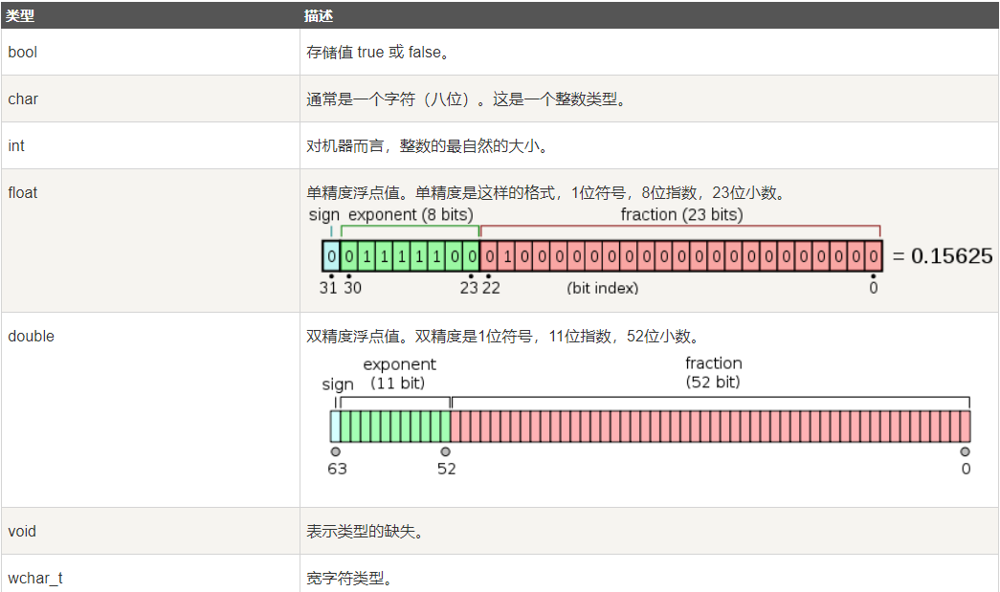

**整数常量**

 整数常量可以是十进制、八进制或十六进制的常量。前缀指定基数：0x 或 0X 表示十六进制，0 表示八进制，不带前缀则默认表示十进制。 


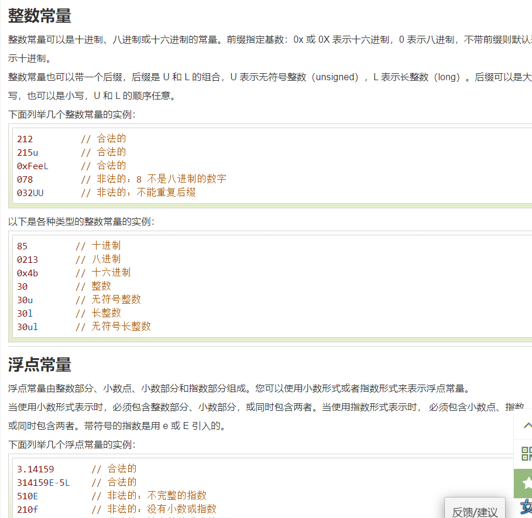


### 常用关键字

**定义常量**

`const关键字`或者`#define`，通常把常量定义为大小字母的形式。

两者的区别： https://blog.csdn.net/Shrimp_millet/article/details/95198131 

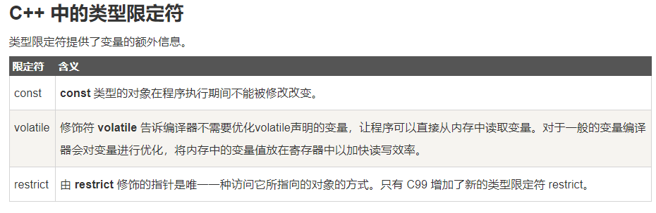

==**[static关键字]([static]( https://www.runoob.com/cplusplus/cpp-storage-classes.html ))**==

==**static** 存储类指示编译器在程序的生命周期内保持局部变量的存在，而不需要在每次它进入和离开作用域时进行创建和销毁。因此，使用 static 修饰局部变量可以在函数调用之间保持局部变量的值。==

static 修饰符也可以应用于全局变量。当 static 修饰全局变量时，会使变量的作用域限制在声明它的文件内。

在 C++ 中，当 static 用在类数据成员上时，会导致仅有一个该成员的副本被类的所有对象共享。

**extern 存储类**

**extern** 存储类用于提供一个全局变量的引用，全局变量对所有的程序文件都是可见的。当您使用 'extern' 时，对于无法初始化的变量，会把变量名指向一个之前定义过的存储位置。

当您有多个文件且定义了一个可以在其他文件中使用的全局变量或函数时，可以在其他文件中使用 *extern* 来得到已定义的变量或函数的引用。可以这么理解，*extern* 是用来在另一个文件中声明一个全局变量或函数。

### 运算符的优先级

| 后缀       | () [] -> . ++ - -                 | 从左到右 |
| ---------- | --------------------------------- | -------- |
| 一元       | + - ! ~ ++ - - (type)* & sizeof   | 从右到左 |
| 乘除       | * / %                             | 从左到右 |
| 加减       | + -                               | 从左到右 |
| 移位       | << >>                             | 从左到右 |
| 关系       | < <= > >=                         | 从左到右 |
| 相等       | == !=                             | 从左到右 |
| 位与 AND   | &                                 | 从左到右 |
| 位异或 XOR | ^                                 | 从左到右 |
| 位或 OR    | \|                                | 从左到右 |
| 逻辑与 AND | &&                                | 从左到右 |
| 逻辑或 OR  | \|\|                              | 从左到右 |
| 条件       | ?:                                | 从右到左 |
| 赋值       | = += -= *= /= %=>>= <<= &= ^= \|= | 从右到左 |
| 逗号       | ,                                 | 从左到右 |


### [cctype]( https://www.runoob.com/cprogramming/c-standard-library-ctype-h.html )

- [**isalnum**](http://www.cplusplus.com/reference/cctype/isalnum/)

  Check if character is alphanumeric (function )，字母或数字

  当为字母时，返回2；当为数字时，返回4；否则返回0

- [**isalpha**](http://www.cplusplus.com/reference/cctype/isalpha/)

  Check if character is alphabetic (function )，是否为字母

- [**isblank** ](http://www.cplusplus.com/reference/cctype/isblank/)

  Check if character is blank (function )，是否为 `空格`或者t,\r，\n

- [**iscntrl**](http://www.cplusplus.com/reference/cctype/iscntrl/)

  Check if character is a control character (function )，是否为控制字符

- [**isdigit**](http://www.cplusplus.com/reference/cctype/isdigit/)

  Check if character is decimal digit (function )，是否为十进制数字

- [**isgraph**](http://www.cplusplus.com/reference/cctype/isgraph/)

  Check if character has graphical representation (function )， 检查所传的字符是否有图形表示法。 

- [**islower**](http://www.cplusplus.com/reference/cctype/islower/)

  Check if character is lowercase letter (function )，小写字母

- [**isprint**](http://www.cplusplus.com/reference/cctype/isprint/)

  Check if character is printable (function )是否可打印

- [**ispunct**](http://www.cplusplus.com/reference/cctype/ispunct/)

  Check if character is a punctuation character (function )，标点符号

- [**isspace**](http://www.cplusplus.com/reference/cctype/isspace/)

  Check if character is a white-space (function )，是否为空白字符

- [**isupper**](http://www.cplusplus.com/reference/cctype/isupper/)

  Check if character is uppercase letter (function ) 大写字母

- [**isxdigit**](http://www.cplusplus.com/reference/cctype/isxdigit/)

  Check if character is hexadecimal digit (function ) 十六进制数

### [Lambda表达式]( https://www.runoob.com/cplusplus/cpp-functions.html )

```c++
// 带返回值：[capture](parameters)->return-type{body}
[](int x, int y){ return x < y ; }

// 无返回值：[capture](parameters){body}
[]{ ++global_x; } 
```

### 字符串比较

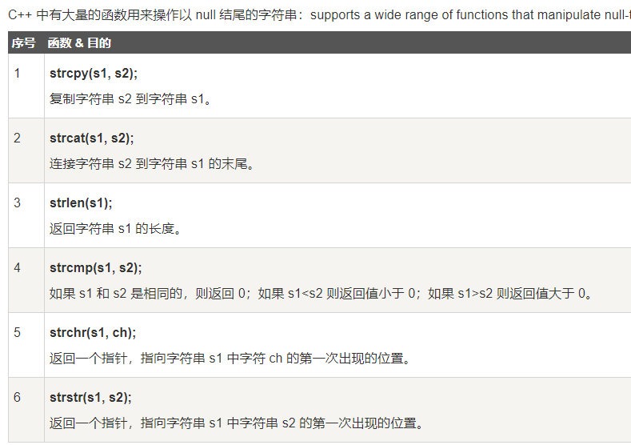

### 指针和引用

 **指针**是一个变量，其值为另一个变量的地址，即，内存位置的直接地址。 

 **引用变量**是一个别名，也就是说，它是某个已存在变量的另一个名字。一旦把引用初始化为某个变量，就可以使用该引用名称或变量名称来指向变量。 

引用很容易与指针混淆，它们之间有三个主要的不同：

- 不存在空引用。引用必须连接到一块合法的内存。
- 一旦引用被初始化为一个对象，就不能被指向到另一个对象。指针可以在任何时候指向到另一个对象。
- 引用必须在创建时被初始化。指针可以在任何时间被初始化。

### [日期和时间]( https://www.runoob.com/cplusplus/cpp-date-time.html )


### [输入和输出]( https://www.runoob.com/cplusplus/cpp-basic-input-output.html )


### [类和对象]( https://www.runoob.com/cplusplus/cpp-classes-objects.html )

类的构造函数小问题：

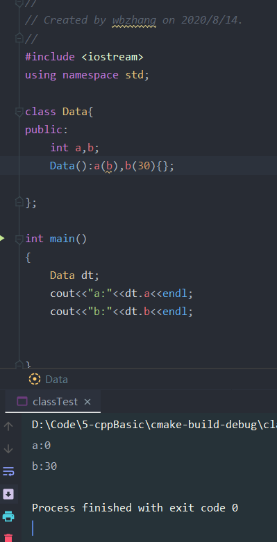

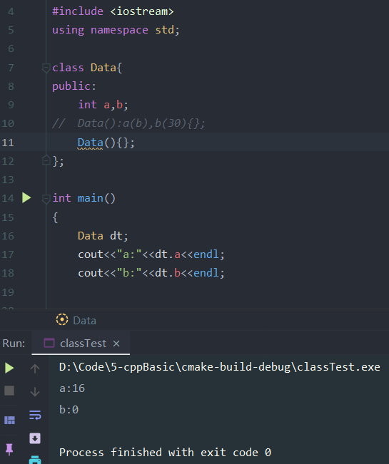


**友元函数**

类的友元函数是定义在类外部，但有权访问类的所有私有（private）成员和保护（protected）成员。尽管友元函数的原型有在类的定义中出现过，但是友元函数并不是成员函数。

友元可以是一个函数，该函数被称为友元函数；友元也可以是一个类，该类被称为友元类，在这种情况下，整个类及其所有成员都是友元。

如果要声明函数为一个类的友元，需要在类定义中该函数原型前使用关键字 **friend**。

==**内联函数**==

C++ **内联函数**是通常与类一起使用。==如果一个函数是内联的，那么在编译时，编译器会把该函数的代码副本放置在每个调用该函数的地方。对内联函数进行任何修改，都需要重新编译函数的所有客户端，因为编译器需要重新更换一次所有的代码，否则将会继续使用旧的函数。==


如果想把一个函数定义为内联函数，则需要在函数名前面放置关键字 **inline**，在调用函数之前需要对函数进行定义。如果已定义的函数多于一行，编译器会忽略 inline 限定符。

==在类定义中的定义的函数都是内联函数，即使没有使用 **inline** 说明符。==

**内联函数inline：**引入内联函数的目的是为了解决程序中函数调用的效率问题，这么说吧，==程序在编译器编译的时候，编译器将程序中出现的内联函数的调用表达式用内联函数的函数体进行替换，而对于其他的函数，都是在运行时候才被替代。==这其实就是个空间代价换时间的i节省。==所以内联函数一般都是1-5行的小函数。==在使用内联函数时要留神： 

- **<font color='red' >1.只有当函数只有10行甚至更少的时候才能将其定义为内联函数。在内联函数内不允许使用循环语句和开关语句</font>**
- 2.内联函数的定义必须出现在内联函数第一次调用之前；
- 3.类结构中所在的类说明内部定义的函数是内联函数。

定义: 当函数被声明为内联函数之后, 编译器会将其内联展开, 而不是按通常的函数调用机制进行调用.

**优点:** 当函数体比较小的时候, 内联该函数可以令目标代码更加高效. 对于存取函数以及其它函数体比较短, 性能关键的函数, 鼓励使用内联.


**静态成员**

我们可以使用 **static** 关键字来把类成员定义为静态的。==当我们声明类的成员为静态时，这意味着无论创建多少个类的对象，静态成员都只有一个副本。==

==静态成员在类的所有对象中是共享的。==如果不存在其他的初始化语句，在创建第一个对象时，所有的静态数据都会被初始化为零。我们不能把静态成员的初始化放置在类的定义中，但是可以在类的外部通过使用范围解析运算符 **::** 来重新声明静态变量从而对它进行初始化，如下面的实例所示。

如果把函数成员声明为静态的，就可以把函数与类的任何特定对象独立开来。静态成员函数即使在类对象不存在的情况下也能被调用，**静态函数**只要使用类名加范围解析运算符 **::** 就可以访问。 


==**虚函数**==

C++中**, 虚函数**可以为private, 并且可以被子类覆盖（因为虚函数表的传递），但子类不能调用父类的private虚函数。虚函数的重载性和它声明的权限无关。

一个成员函数被定义为private属性，标志着其只能被当前类的其他成员函数(或友元函数)所访问。

==而virtual修饰符则强调父类的成员函数可以在子类中被重写，因为重写之时并没有与父类发生任何的调用关系，故而重写是被允许的。==


### [c++继承]()

 // 派生类 class Rectangle: public Shape 

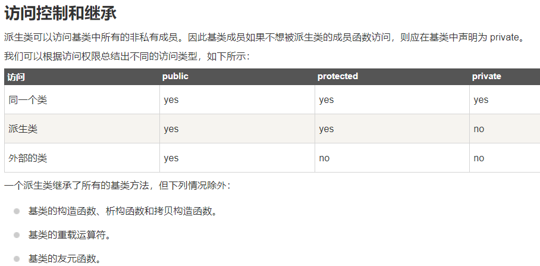

==派生类不能访问父类的私有成员。同时，派生类不能继承基类的重载运算符和友元函数。==

==外部类不能访问分类的保护成员和私有成员。==

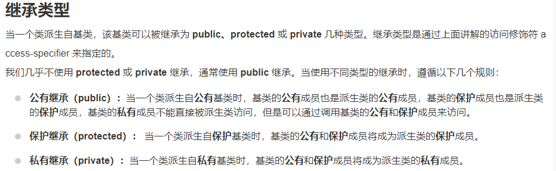

==**多继承**==

```c++
class <派生类名>:<继承方式1><基类名1>,<继承方式2><基类名2>,…
{
<派生类类体>
};
```


#### 运算符重载

```c++
	// 重载函数调用运算符
	Distance operator()(int a, int b, int c)
	{
		Distance D;
		// 进行随机计算
		D.feet = a + c + 10;
		D.inches = b + c + 100 ;
		return D;
	}

	D2 = D1(10, 10, 10); // invoke operator()
```

[下标运算符重载](https://www.runoob.com/cplusplus/subscripting-operator-overloading.html )

```c++
 
class safearay
{
   private:
      int arr[SIZE];
   public:
      safearay() 
      {
         register int i;
         for(i = 0; i < SIZE; i++)
         {
           arr[i] = i;
         }
      }
      int& operator[](int i)
      {
          if( i > SIZE )
          {
              cout << "索引超过最大值" <<endl; 
              // 返回第一个元素
              return arr[0];
          }
          return arr[i];
      }
};
```


### [C++多态]( https://www.runoob.com/cplusplus/cpp-polymorphism.html )

==**多态**按字面的意思就是多种形态。当类之间存在层次结构，并且类之间是通过继承关联时，就会用到多态。==C++ 多态意味着调用成员函数时，会根据调用函数的对象的类型来执行不同的函数。

 一个成员函数被定义为private属性，标志着其只能被当前类的其他成员函数(或友元函数)所访问。


### [异常处理]( https://www.runoob.com/cplusplus/cpp-exceptions-handling.html )

三个关键字： **try、catch、throw**。 

- **throw:** 当问题出现时，程序会抛出一个异常。这是通过使用 **throw** 关键字来完成的。
- **catch:** 在您想要处理问题的地方，通过异常处理程序捕获异常。**catch** 关键字用于捕获异常。
- **try:** **try** 块中的代码标识将被激活的特定异常。它后面通常跟着一个或多个 catch 块。


### 动态内存

C++程序中的内存可分为：

- **栈：**在函数内部声明的所有变量都将占用栈内存。由编译器自动管理。
- **堆：**这是程序中未使用的内存，在程序运行时可用于动态分配内存。产生由程序员通过malloc、new、free、delete等申请和释放。
- **自由存储区：**由malloc等分配的内存，使用free进行释放
- **全局、静态存储区：**全局变量和静态变量被分配到同一块内存中，
- **常量存储区：**里面存放常量，不允许修改

 使用`new`和`delete`来分配动态内存：

```c++
// 数字
double* p = new double;
delete p;

// 数组
char *p = new char[20];
delete [] p;
int *array = new int [m];

// 对象数组
Box* myBoxArray = new Box[4];
delete [] myBoxArray; // 删除数组

```

**malloc()** 函数在 C 语言中就出现了，在 C++ 中仍然存在，但建议尽量不要使用 malloc() 函数。==new 与 malloc() 函数相比，其主要的优点是，new 不只是分配了内存，它还创建了对象。==

> 堆和栈的区别：
>
> 栈的空间有限。


### 多线程

多线程是多任务处理的一种特殊形式，多任务处理允许让电脑同时运行两个或两个以上的程序。一般情况下，两种类型的多任务处理：**基于进程和基于线程**。

- 基于进程的多任务处理是程序的并发执行。
- 基于线程的多任务处理是同一程序的片段的并发执行。

 多线程程序包含可以同时运行的两个或多个部分。这样的程序中的每个部分称为一个线程，每个线程定义了一个单独的执行路径。 

```c++
// 创建线程
#include <pthread.h>
pthread_create (thread, attr, start_routine, arg)
// 终止线程
pthread_exit (status) 
```

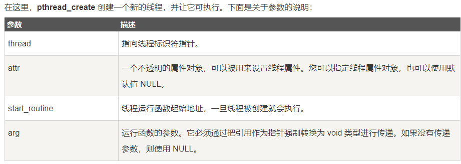


**STL迭代器**

upper_bound()：返回被查找序列中第一个==不小于查找值==的迭代器；

lower_bound()：返回被查找序列中最后一个==不大于等于查找值==的迭代器；

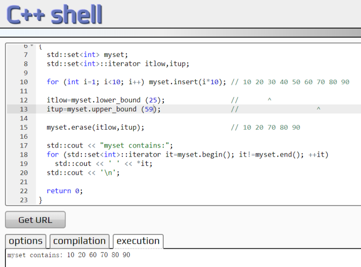

如上图所示，分别对应lower_bound和 upper_bound 分别对应30和50所在位置。


### 杨梓桐之问

三五法则即实现方式与原因

- 多态的实现与虚函数指针/表
- 四种智能指针的辨析与本质区别
- new和delete的实现机理与操作方式
- ==stl中vector与list的底层实现区别与区别所导致的性能差异==
- 内存对齐与32.64位下基本类型的大小
- 函数指针，数组指针，指针数组的辨析


### 对死锁的理解

>  **死锁**是指两个或两个以上的进程在执行过程中，由于竞争资源或者由于彼此通信而造成的一种阻塞的现象，若无外力作用，它们都将无法推进下去。此时称系统处于死锁状态或系统产生了死锁，这些永远在互相等待的进程称为**死锁进程，**例如线程A锁住了记录1并等待记录2，线程B锁住了记录2并等待记录1，这样就产生了死锁现象。 


### 32位和64位下基本类型的大小


### [四种智能指针]( https://blog.csdn.net/K346K346/article/details/81478223?utm_medium=distribute.pc_relevant.none-task-blog-BlogCommendFromMachineLearnPai2-1.channel_param&depth_1-utm_source=distribute.pc_relevant.none-task-blog-BlogCommendFromMachineLearnPai2-1.channel_param )

auto_ptr, unique_ptr, shared_ptr, weak_ptr


### [四种类型转换]( www.cnblogs.com/evenleee/p/10382335.html )

const_cast, static_cast, dynamic_cast, reinterpret_cast

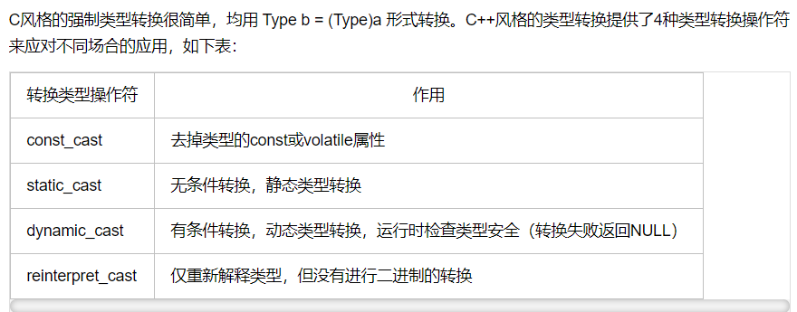


### 三五法则

1. 需要析构函数的类也需要拷贝构造函数和拷贝赋值函数。
2. 需要拷贝操作的类也需要赋值操作，反之亦然。
3. 析构函数不能是删除的
4. 如果一个类有删除的或不可访问的析构函数，那么其默认和拷贝构造函数会被定义为删除的。
5. 如果一个类有const或引用成员，则不能使用合成的拷贝赋值操作。 


### STL中容器的底层实现

**其他问题：** 多态、虚函数，指针、函数指针，指针函数，宏和内联，内存分配类问题。 

函数返回时，返回值、返回引用和返回指针的区别 

 https://www.nowcoder.com/discuss/178153?type=0&order=0&pos=8&page=1 

### [虚函数是否可以声明为inline?]( https://www.cnblogs.com/helloweworld/archive/2013/06/03/3116069.html )

当然还有其他情况可以被inline，总的意思是**虚函数可以申明为inline，具体到编译器解释时候，如果编译器在编译的时候就可以确定该虚函数的决议，则编译器以inline方式静态决议该虚函数。如果编译器在编译的时候不能决定，则必须在运行时决议虚函数，此时虚函数不能以inline函数的方式调用。** 


