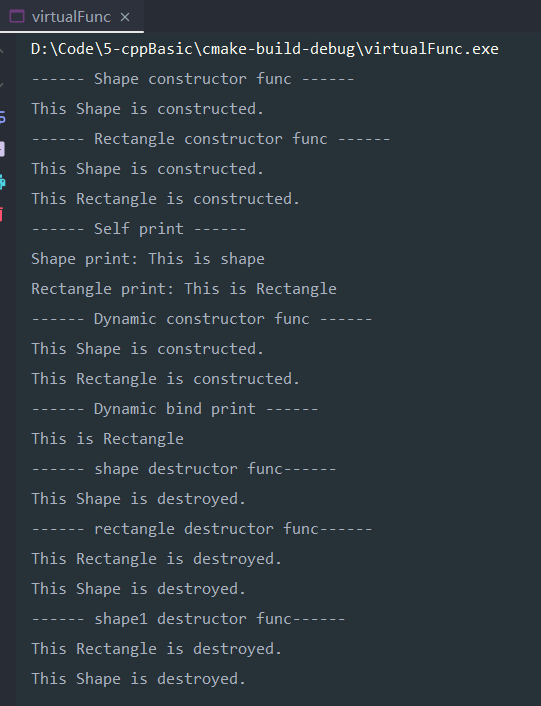
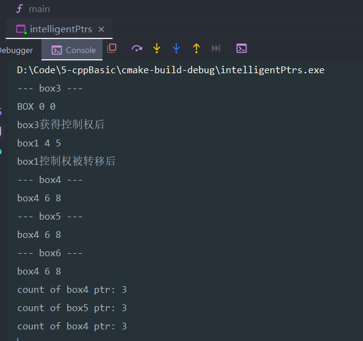
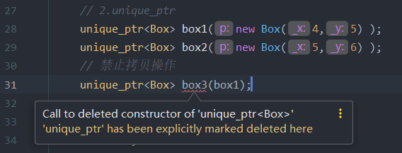

# cpp_basic

> 该代码仓专门用于测试cpp基础特性与功能，以加深理解。:flushed:
>

# 测试日志
## 2020.09.19
测试了如下功能：
 1. const char * ：辨析

 2. struct align：结构体对齐

 3. virtual Func的实现以及多种功能

    

    > 总结如下：
>
    > 1) 虚函数原理：虚表指针与虚函数表  
>
    > 2) 构造函数：先基类，再派生类的成员，再调用派生类构造函数 
>
    > 3) 析构函数：先调用子类析构函数，再调用父类析构函数 
>
    > 4) 纯虚函数-->接口类，抽象类

## 2020.09.22
测试了如下功能：
1. 四种智能指针

   结果如下：

   

   

2. sizeof与strlen的辨析

3. 四种强制类型转换

> 总结：
>
> 1)  要能够对四种智能指针有很清楚的认识，其实主要是后三种。以及共享指针引用计数问题和互相指向会引起死锁的问题。
>
> 2）明晰指针和数组，以及**单目操作符sizeof**和**c库函数strlen**的区别。

